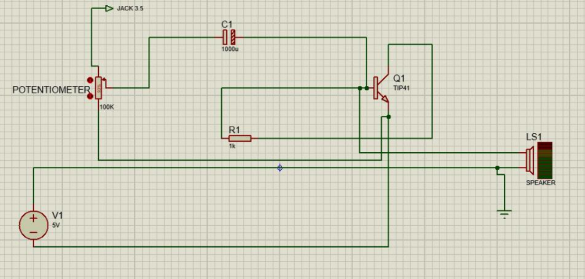
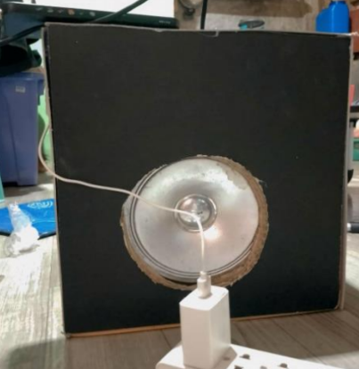

# Leah Billo Portfolio

Hello and welcome to my portfolio repository.

My name is Leah Billo, a third-year Computer Engineering student from CE3A. This repository serves as a collection of my academic projects, programming works, and technical activities.

---

# 📌 About Me

- Course: Bachelor of Science in Computer Engineering
- Section: CE3A

I am motivated to learn more about software development, embedded systems, and computer hardware. I enjoy participating in technical activities that improve my creativity and analytical skills.

---

# 🛠 Skills

- Python
- C++
- Circuit Troubleshooting
- Networking
- GitHub
- Basic Web Design

---

# 📂 Academic Projects

## 🔹 Mini Amplifier Using TIP41

### Description
This project is a simple audio amplifier circuit using a TIP41 transistor to amplify low audio signals into louder sound output through a speaker. The project demonstrates the fundamentals of transistor-based amplification, electronic circuit assembly, and audio signal processing.

### Technologies Used
- Electronic Circuit Design
- Proteus (Schematic Design and 3D Modeling)
- Soldering Techniques
- Analog Electronics

### Components Used
- NPN Transistor TIP41
- Capacitor
- Resistor
- Potentiometer
- Heatsink
- Connector
- Speaker
- Audio Jack
- Jumper Wires

### Project Screenshot
 

 

---

# 📬 Contact Information

- Email: leahbillo888@gmail.com
- GitHub: https://github.com/Leah-Billo
